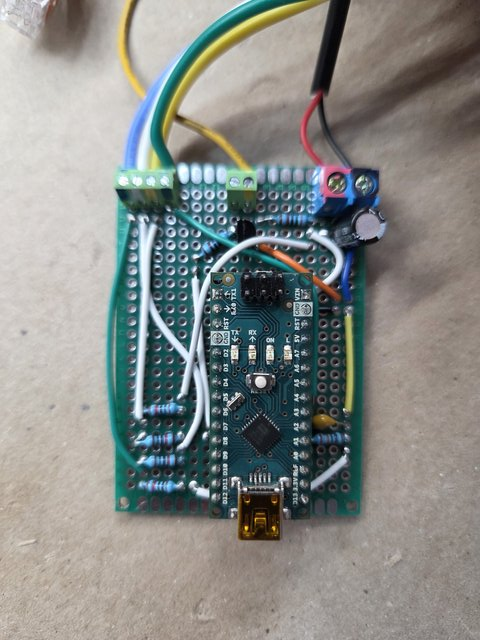
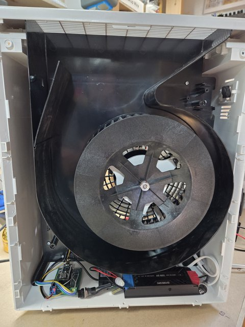
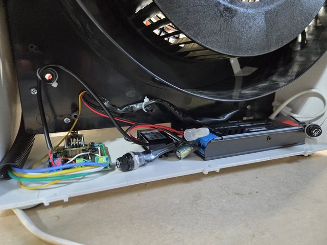
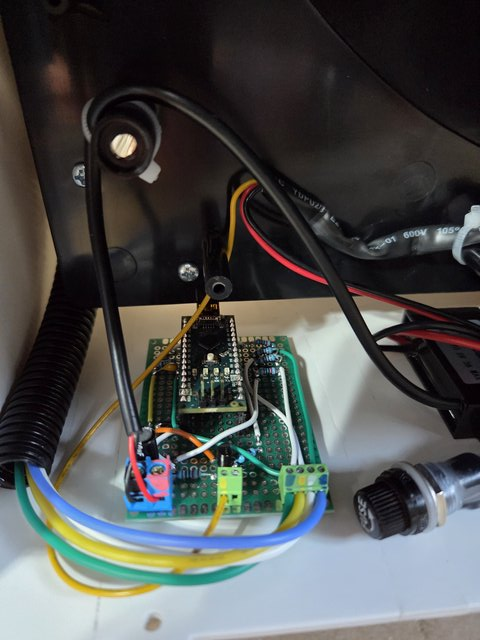
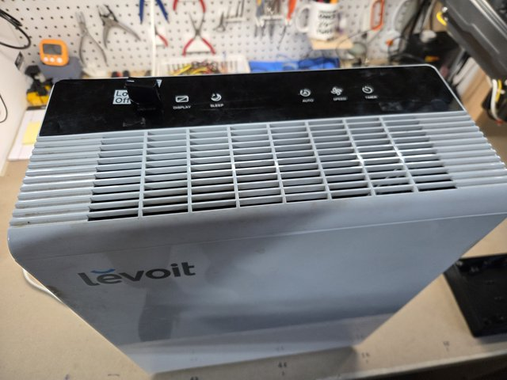
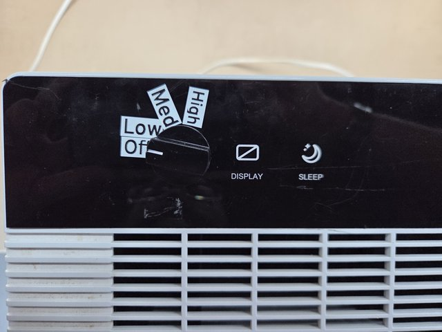

# levoit-LV-PUR131-fan-controller

Arduino-based replacement fan controller for the [Levoit LV-PUR131](https://www.amazon.com/dp/B06W54K29J) air filter.

After six years, the control board in one of my Amazon-bought [Levoit LV-PUR131](https://www.amazon.com/dp/B06W54K29J) air filters finally failed. Seeing as I don't use most of its features and only use it for low/medium/high constant-on, I figured I'd just make a replacement fan controller using a 4-position rotaty switch. Unfortunately it's a PWM-controlled fan, so it required an Arduino too.

## Contents

* [fan_controller_rotary_with_fuses_caps.pdf](./fan_controller_rotary_with_fuses_caps.pdf) - PDF schematic and wiring info for breadboard testing (ChatGPT / GPT5 generated)
* [levoit-LV-PUR131-fan-controller.ino](./levoit-LV-PUR131-fan-controller.ino) - Arduino sketch to control the fan based on a 4-position (off/low/medium/high) rotary switch input (ChatGPT / GPT5 generated)

## Photos

